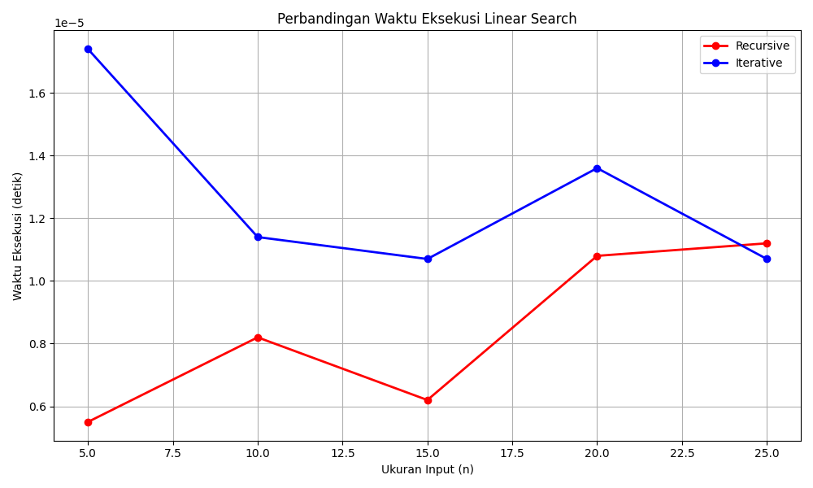

# Tugas Akhir: Analisis Kompleksitas Algoritma

## Anggota Kelompok :
- **Muhammad Deka Maulana** (2311102148)
- **Najwa Humairah** (2311102134)

---

## Perbandingan Waktu Eksekusi Linear Search (Iteratif vs Rekursif)

Proyek ini membandingkan waktu eksekusi antara dua implementasi algoritma Linear Search, yaitu versi iteratif dan rekursif. Pengguna dapat memasukkan ukuran input (n) dan kriteria pencarian, serta melihat perbandingan waktu eksekusi dan hasil pencarian dalam bentuk tabel dan grafik.

## Fitur Utama
- Implementasi algoritma Linear Search baik secara iteratif maupun rekursif.
- Pengguna dapat menginputkan kriteria pencarian berdasarkan title, author, atau category serta memasukkan jumlah buku yang akan dicari (n).
- Menampilkan hasil pencarian untuk kedua metode (iteratif dan rekursif).
- Perbandingan waktu eksekusi ditampilkan dalam bentuk tabel yang rapi.
- Menampilkan grafik perbandingan waktu eksekusi antara metode iteratif dan rekursif.
- Tabel dan grafik menampilkan waktu eksekusi dalam detik berdasarkan ukuran input (n).


```python
# Fungsi Linear Search Iteratif
def linear_search_iterative(arr, key, value):
    result = []
    for item in arr:
        if item[key].lower() == value.lower():
            result.append(item)
    return result

# Fungsi Linear Search Rekursif
def linear_search_recursive(arr, n, key, value, result=None):
    if result is None:
        result = []
    if n == 0:
        return result
    if arr[n - 1][key].lower() == value.lower():
        result.append(arr[n - 1])
    return linear_search_recursive(arr, n - 1, key, value, result)
```

## Output Terminal

```plaintext
Run 1 - Masukkan kriteria pencarian:
Masukkan kriteria (title/author/category): title
Masukkan title yang ingin dicari: The Great Gatsby
Masukkan jumlah buku yang akan dicari (n): 5

Hasil Pencarian (Iterative): [{'id': 101, 'title': 'The Great Gatsby', 'author': 'F. Scott Fitzgerald', 'category': 'Fiction'}]
Hasil Pencarian (Recursive): [{'id': 101, 'title': 'The Great Gatsby', 'author': 'F. Scott Fitzgerald', 'category': 'Fiction'}]
 n  Recursive Time (s)  Iterative Time (s)
 5            0.000005            0.000017

Run 2 - Masukkan kriteria pencarian:
Masukkan kriteria (title/author/category): title
Masukkan title yang ingin dicari: 1984
Masukkan jumlah buku yang akan dicari (n): 10

Hasil Pencarian (Iterative): [{'id': 102, 'title': '1984', 'author': 'George Orwell', 'category': 'Dystopian'}, {'id': 102, 'title': '1984', 'author': 'George Orwell', 'category': 'Dystopian'}]
Hasil Pencarian (Recursive): [{'id': 102, 'title': '1984', 'author': 'George Orwell', 'category': 'Dystopian'}, {'id': 102, 'title': '1984', 'author': 'George Orwell', 'category': 'Dystopian'}]
 n  Recursive Time (s)  Iterative Time (s)
 5            0.000005            0.000017
10            0.000008            0.000011

Run 3 - Masukkan kriteria pencarian:
Masukkan kriteria (title/author/category): title                  
Masukkan title yang ingin dicari: To Kill a Mockingbird
Masukkan jumlah buku yang akan dicari (n): 15

Hasil Pencarian (Iterative): [{'id': 103, 'title': 'To Kill a Mockingbird', 'author': 'Harper Lee', 'category': 'Fiction'}, {'id': 103, 'title': 'To Kill a Mockingbird', 'author': 'Harper Lee', 'category': 'Fiction'}]
Hasil Pencarian (Recursive): [{'id': 103, 'title': 'To Kill a Mockingbird', 'author': 'Harper Lee', 'category': 'Fiction'}, {'id': 103, 'title': 'To Kill a Mockingbird', 'author': 'Harper Lee', 'category': 'Fiction'}]
 n  Recursive Time (s)  Iterative Time (s)
 5            0.000005            0.000017
10            0.000008            0.000011
15            0.000006            0.000011

Run 4 - Masukkan kriteria pencarian:
Masukkan kriteria (title/author/category): title
Masukkan title yang ingin dicari: The Catcher in the Rye
Masukkan jumlah buku yang akan dicari (n): 20

Hasil Pencarian (Iterative): [{'id': 104, 'title': 'The Catcher in the Rye', 'author': 'J.D. Salinger', 'category': 'Fiction'}, {'id': 104, 'title': 'The Catcher in the Rye', 'author': 'J.D. Salinger', 'category': 'Fiction'}, {'id': 104, 'title': 'The Catcher in the Rye', 'author': 'J.D. Salinger', 'category': 'Fiction'}]
Hasil Pencarian (Recursive): [{'id': 104, 'title': 'The Catcher in the Rye', 'author': 'J.D. Salinger', 'category': 'Fiction'}, {'id': 104, 'title': 'The Catcher in the Rye', 'author': 'J.D. Salinger', 'category': 'Fiction'}, {'id': 104, 'title': 'The Catcher in the Rye', 'author': 'J.D. Salinger', 'category': 'Fiction'}]
 n  Recursive Time (s)  Iterative Time (s)
 5            0.000005            0.000017
10            0.000008            0.000011
15            0.000006            0.000011
20            0.000011            0.000014

Run 5 - Masukkan kriteria pencarian:
Masukkan kriteria (title/author/category): title
Masukkan title yang ingin dicari: Sapiens
Masukkan jumlah buku yang akan dicari (n): 25

Hasil Pencarian (Iterative): [{'id': 105, 'title': 'Sapiens', 'author': 'Yuval Noah Harari', 'category': 'History'}, {'id': 105, 'title': 'Sapiens', 'author': 'Yuval Noah Harari', 'category': 'History'}, {'id': 105, 'title': 'Sapiens', 'author': 'Yuval Noah Harari', 'category': 'History'}]
Hasil Pencarian (Recursive): [{'id': 105, 'title': 'Sapiens', 'author': 'Yuval Noah Harari', 'category': 'History'}, {'id': 105, 'title': 'Sapiens', 'author': 'Yuval Noah Harari', 'category': 'History'}, {'id': 105, 'title': 'Sapiens', 'author': 'Yuval Noah Harari', 'category': 'History'}]
 n  Recursive Time (s)  Iterative Time (s)
 5            0.000005            0.000017
10            0.000008            0.000011
15            0.000006            0.000011
20            0.000011            0.000014
25            0.000011            0.000011

Program selesai!
```

### Output Grafik
